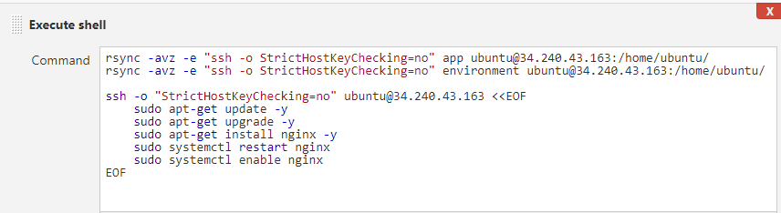
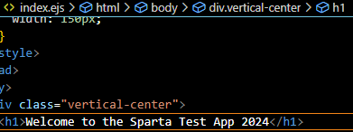

# CD with Jenkins
To deploy the app using jenkins to aws, it would require a few steps: to copy the app code and store it somewhere, to reach the instance using a pem file and automate a process to check the key and bypass it without user intervention.

## Deploying nginx to AWS
1. Create the ec2 instance with AMI, security group and pem file (pem file will be needed for jenkins too)
2. Create Jenkins job for CD with name: `name-CD`
3. Standard config: 
   - Discard old builds with 3 max builds
   - Github Project - insert github https url
   - Src Code management - insert github ssh url associated with its ssh private key
   - Build environment - Provide Node
4. `SSH Agent` - this will be adding the pem file that is used to ssh into aws
   
5. `Build` - This is where shell script will be added to start running nginx 
   - 
   ```
   # ensure the aws security group allows ssh to jenkins ip
   # Everytime we SSH into the ec2, it asked to say y/n as you are adding ip address to hostnames list. Following command:
   ssh -o "StrictHostKeyChecking=no" ubuntu@(ipaddress) <<EOF
	sudo apt-get update -y
    sudo apt-get upgrade -y
    sudo apt-get install nginx -y
    sudo systemctl restart nginx
    sudo systemctl enable nginx
    EOF
   ```

## Deploying the app: Lttle bit of Jenkins + Manually
Jenkins stores code within the workspaces, using this storage area we can copy the code to a destination which we want the app code inside our ec2. This will work because we have successfully connected the ec2 with jenkins. *WILL MANUALLY RUN APP SCRIPT AND DEPLOY USING EC2*
1. Within the CD Job, add to the shell script
2. - `rsync -avz -e "ssh -o StrictHostKeyChecking=no" app ubuntu@34.240.43.163:/home/ubuntu/` - copying app folder from workspace on jenkins to the ec2
   - `rsync -avz -e "ssh -o StrictHostKeyChecking=no" environment ubuntu@34.240.43.163:/home/ubuntu/` - copying environment folder to ec2
  
3. SSH into the ec2 instance on local machine using GitBash
4. cd into app script following `cd environment/app`
5. there should be a `provision.sh` script, give it execute permissions using `chmod +x provision.sh`
6. run the script using `./provision.sh`, it will install the dependencies
7. if npm is not found, install using `sudo apt-get install npm -y`
8. cd back to the main app folder
9. run `npm install` then `npm start` and the app will run and can view using ip address:3000

### Using the Merge Job to trigger the CD job for when changes are made to the app in a separate branch 
1. Go back to your merge job
2. Add `Post Build Action` -> add your CD Job to it
   - -> This will mean whenever a change is made, the CD job will see a change has been made to the app code and will trigger the merge to the master branch
3. Make a change to the app e.g: change index.ejs line to include year in the title
   
4. Go back to your ec2 terminal, and run npm start which should reload the changes
   
