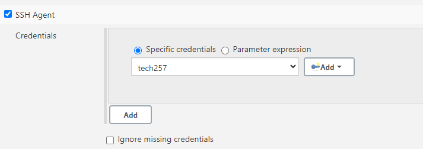

# CD with Jenkins
To deploy the app using jenkins to aws, it would require a few steps: to copy the app code and store it somewhere, to reach the instance using a pem file and automate a process to check the key and bypass it without user intervention.

## Deploying nginx to AWS
1. Create the ec2 instance with AMI, security group and pem file (pem file will be needed for jenkins too)
2. Create Jenkins job for CD with name: `name-CD`
3. Standard config: 
   - Discard old builds with 3 max builds
   - Github Project - insert github https url
   - Src Code management - insert github ssh url associated with its ssh private key
   - Build environment - Provide Node
4. `SSH Agent` - this will be adding the pem file that is used to ssh into aws
   
5. `Build` - This is where shell script will be added to start running nginx 
   - 
   ```
   # ensure the aws security group allows ssh to jenkins ip
    # ensure file.pem provided to jenkins
    # ensure ec2 is running
   ssh -o "StrictHostKeyChecking=no" ubuntu@(ipaddress) <<EOF
	sudo apt-get update -y
    sudo apt-get upgrade -y
    sudo apt-get install nginx -y
    sudo systemctl restart nginx
    sudo systemctl enable nginx
EOF
   ```