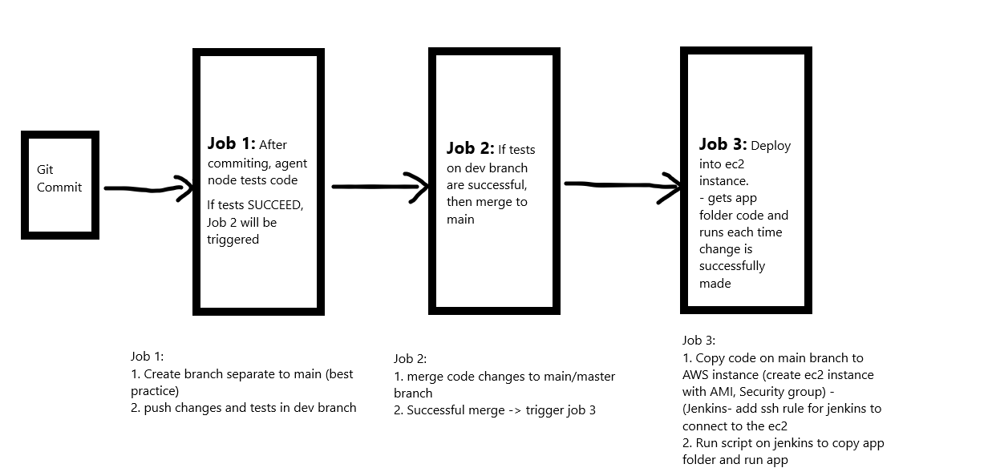
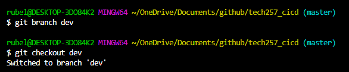

# CI/CDE Steps to follow to Successfully Deploy

## 1. Job 1: CI & Testing on Dev branch
1. Create dev branch on gitbash/vsc
   - `git branch <name>`
   - `git checkout <branchname>` - switches to branch
   
2. Create Job used to test the code within the dev branch
3. `Discard old builds` - 3 max builds
4. `Git project` - add your github that will be used HTTPS URL
5. `Office 365 Connector` - Select 'Restrict where this project can be run' and enter `sparta-ubuntu-node` - This is the agent node where the testing happens
6. `Source Code Management` - Add SSH URL of github with its SSH key which needs to match
   - specifify the dev branch 
7. `Build Triggers` - Create a webhook on github using the jenkins URL/github-webhook/ as this will trigger the github request automatically
   - Select Github hook trigger
8.  `Build environment` - Provide Node
9.  `Build` - add the script which tests the code changes
    ```
    cd app
    npm install
    npm test
    ```
8. Will add post buid project to trigger Job 2 but need to create Job 2 first

## Job 2: Merge Job
1. Create Job used to test the code within the dev branch
3. `Discard old builds` - 3 max builds
4. `Git project` - add your github that will be used HTTPS URL
5. `Office 365 Connector` - Select 'Restrict where this project can be run' and enter `sparta-ubuntu-node` - This is the agent node where the testing happens
6. `Source Code Management` - Add SSH URL of github with its SSH key which needs to match
   - specifify the dev branch 
7. `Build Triggers` - Select Github hook trigger
8.  `Build environment` - Provide Node
9.  `Post Build Action`
    1. Git Publisher - This will merge the builds, select Push only if build succeeds and merge results
    2. Add branches - master/origin as this is where we want changes from dev to push to
10. Add Post Build project of job 3 once created 

#### Now if we push changes to git from the dev branch, job1 will run to test the code, if successful then job2:merge job will run and will merge the dev branch to the main/master branch

## 3. Job 3: CD
1. Create a job that will be used to deploy the app to AWS - NAME-CD
2. `Discard old builds` - 3 max builds
3. `Git project` - add your github that will be used HTTPS URL
4. `Source Code Management` - Add SSH URL of github with its SSH key which needs to match
5. Specify Main/Master branch
6. `Build environment` 
   1. Provide Node PATH
   2. SSH Agent - create or use same key that is used to access EC2 Instance
7. `Build` - Shell Script
   ```
   # copies and replaces app and environment folder
    rsync -avz -e "ssh -o StrictHostKeyChecking=no" app ubuntu@54.73.113.225:/home/ubuntu/
    rsync -avz -e "ssh -o StrictHostKeyChecking=no" environment ubuntu@54.73.113.225:/home/ubuntu/

    # auto ssh into ec2 but will do without needing the 'add to hostname' user intervention
    ssh -o "StrictHostKeyChecking=no" ubuntu@54.73.113.225 <<EOF
	sudo apt-get update -y
    sudo apt-get upgrade -y
    sudo apt-get install nginx -y
    sudo systemctl restart nginx
    sudo systemctl enable nginx

    # cd into app, kill node running if ran 2nd time, run node in the background (npm start breaks jenkins)
	cd app
    kill -all -9 node
	npm install
    nohup node app.js > /dev/null 2>&1 &
   ```
8. Add this as `Post Build Action` in JOB2 = merge job
   - when a change is merged to main, this job will be triggered and will update the old app folder with the new folder with new changes

#### 