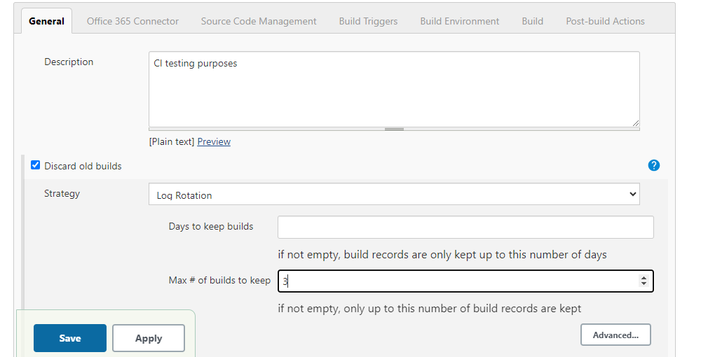
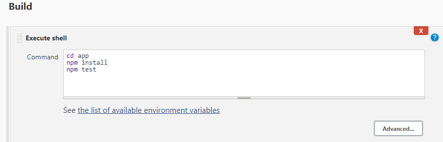

# CI with Jenkins

## Creating  job
1. `New item` - will take you to build the jenkins job
2. `Name` - appropriately name it
3. Select `Freestyle Project`
4. Give description (optional)
5. `Discard old builds` - after the specified amount of builds ran, it was delete the oldest one
   
6. `Github Project` - you will give your HTTP link to this section which finds your github repo to use
7. `Office 365 Connector` - Select 'Restrict where the project can run' and enter the label as 'sparta-ubuntu-node' - this is the agent node used to test 
   
8. `Source Code management` - you are adding your github SSH URL so it can find, match and store the private key that will be used to communicate github and jenkins
   - Also specificy your branch
9. `Build triggers` - the type of triggers that can be enabled, we will use 'Github hook trigger' which is the webhook that will enable notifications when an event takes place 
10. `Build Environment` - 'Provide Node & npm bin/ folder to PATH' - default settings will suffice
11. `Build` - how the build will be done and as we used shell, we will specify shell
    

## Creating a webhook 
Webhook is a tool which is used to notify when specific events happen. This can be setup on Github on the repo which you want notifcations for
1. Go to `Settings`
2. Go to `Webhook`
3. Add webhook
4. `Payload URL` = URL of the jenkins pipeline followed by `/github-webhook`
5. Configure the type of notification - when will it send it?
6. Then go to the Jenkins CI configuration and on `Build triggers`, enable GitHub hook trigger

