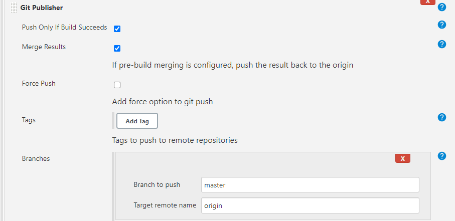

# CI with Jenkins

## Creating a job
1. `New item` - will take you to build the jenkins job
2. `Name` - appropriately name it
3. Select `Freestyle Project`
4. Give description (optional)
5. `Discard old builds` - after the specified amount of builds ran, it was delete the oldest one
   
6. `Github Project` - you will give your HTTP link to this section which finds your github repo to use
7. `Office 365 Connector` - Select 'Restrict where the project can run' and enter the label as 'sparta-ubuntu-node' - this is the agent node used to test 
   
8. `Source Code management` - you are adding your github SSH URL so it can find, match and store the private key that will be used to communicate github and jenkins
   - Also specificy your branch
9. `Build triggers` - the type of triggers that can be enabled, we will use 'Github hook trigger' which is the webhook that will enable notifications when an event takes place 
10. `Build Environment` - 'Provide Node & npm bin/ folder to PATH' - default settings will suffice
11. `Build` - how the build will be done and as we used shell, we will specify shell
    

## Build a job
1. `Build Now` - This will run a build
   
2. In the History it will show the builds ran with the most recent one
   - originally starts white
   - turns blue if successful
   - turns red if unsucessful
  

## Creating a webhook 
Webhook is a tool which is used to notify when specific events happen. This can be setup on Github on the repo which you want notifcations for
1. Go to `Settings`
2. Go to `Webhook`
3. Add webhook
4. `Payload URL` = URL of the jenkins pipeline followed by `/github-webhook`
5. Configure the type of notification - when will it send it?
6. Then go to the Jenkins CI configuration and on `Build triggers`, enable GitHub hook trigger

## How to merge new changes from a branch to master using jenkins
It is best practice to always work and make code changes in a separate branch from the main. 
- Prevents bugs
- Wont crash main app if there are code issues before merging

1. Make Webhook using ip address of jenkins
   - Note: If jenkins instance is restarted, the ip address will change so webhook will need to be changed everytime it is restarted.
2. Create dev branch on gitbash/vsc
   - `git branch <name>`
   - `git checkout <branchname>` - switches to branch
   
3. On jenkins job config, change branch to new branch too
4. Create new job which will be triggered when a push is made and will do the merge
   1. Call it `name-CI-Merge`
   2. Configure with usual settings: discard old builds, git project with http link, git source management, agent node, 
3. `Post Build Actions` - This is what will do the merging
   - use Git Publisher plug in
     - Use these configurations:
  
6. Now that this job is created, we need to add it as a post build action to the initial job created to push changes
