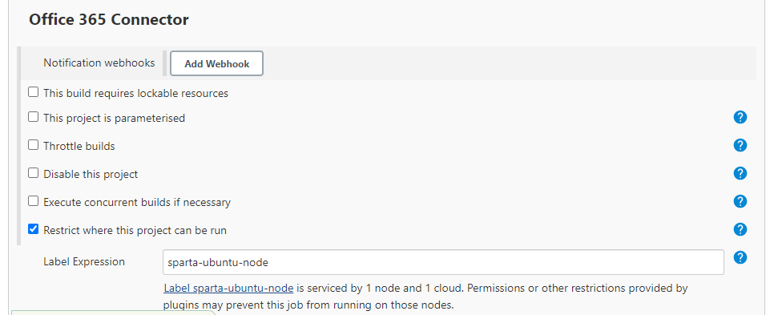

# Jenkins
## What is it?
- Open source 
- Automates build/test/development of software
- what is sent by Github, it will test and decide to accept and push or reject and send back
  - Master node: Branch where the main repo is stored in order to not break the pipeline if it doesnt work
  - Agent node: Isolated environment for the testing, used so if there is any problems it wont affect the whole code in the master node
1. Jenkins tests the code and if successful, will push to production (AWS, AZ)
2. If code has issues and fails, will send back to github

# CI with Jenkins

## Creating a job
1. `New item` - will take you to build the jenkins job
2. `Name` - appropriately name it
3. Select `Freestyle Project`
4. Give description (optional)
5. `Discard old builds` - after the specified amount of builds ran, it was delete the oldest one
   
6. `Github Project` - you will give your HTTP link to this section which finds your github repo to use
7. `Office 365 Connector` - Select 'Restrict where the project can run' and enter the label as 'sparta-ubuntu-node' - this is the agent node used to test 
   
8. `Source Code management` - you are adding your github SSH URL so it can find, match and store the private key that will be used to communicate github and jenkins
   - Also specificy your branch
9. `Build triggers` - the type of triggers that can be enabled, we will use 'Github hook trigger' which is the webhook that will enable notifications when an event takes place 
10. `Build Environment` - 'Provide Node & npm bin/ folder to PATH' - default settings will suffice
11. `Build` - how the build will be done and as we used shell, we will specify shell
    

## Build a job
1. `Build Now` - This will run a build
   
2. In the History it will show the builds ran with the most recent one
   - originally starts white
   - turns blue if successful
   - turns red if unsucessful
  

## Creating a webhook 
Webhook is a tool which is used to notify when specific events happen. This can be setup on Github on the repo which you want notifcations for
1. Go to `Settings`
2. Go to `Webhook`
3. Add webhook
4. `Payload URL` = URL of the jenkins pipeline followed by `/github-webhook`
5. Configure the type of notification - when will it send it?
6. Then go to the Jenkins CI configuration and on `Build triggers`, enable GitHub hook trigger

## How to merge new changes from a branch to master using jenkins
It is best practice to always work and make code changes in a separate branch from the main. 
- Prevents bugs
- Wont crash main app if there are code issues before merging

1. Make Webhook using ip address of jenkins
   - Note: If jenkins instance is restarted, the ip address will change so webhook will need to be changed everytime it is restarted.
2. Create dev branch on gitbash/vsc
   - `git branch <name>`
   - `git checkout <branchname>` - switches to branch
   
3. On jenkins job config, change branch to new branch too
4. Create new job which will be triggered when a push is made and will do the merge
   1. Call it `name-CI-Merge`
   2. Configure with usual settings: discard old builds, git project with http link, git source management, agent node, 
3. `Post Build Actions` - This is what will do the merging
   - use Git Publisher plug in
     - Use these configurations:
  
6. Now that this job is created, we need to add it as a post build action to the initial job created to push changes

# CD with Jenkins
To deploy the app using jenkins to aws, it would require a few steps: to copy the app code and store it somewhere, to reach the instance using a pem file and automate a process to check the key and bypass it without user intervention.

## Deploying nginx to AWS
1. Create the ec2 instance with AMI, security group and pem file (pem file will be needed for jenkins too)
2. Create Jenkins job for CD with name: `name-CD`
3. Standard config: 
   - Discard old builds with 3 max builds
   - Github Project - insert github https url
   - Src Code management - insert github ssh url associated with its ssh private key
   - Build environment - Provide Node
4. `SSH Agent` - this will be adding the pem file that is used to ssh into aws
   
5. `Build` - This is where shell script will be added to start running nginx 
   - 
   ```
   # ensure the aws security group allows ssh to jenkins ip
   # Everytime we SSH into the ec2, it asked to say y/n as you are adding ip address to hostnames list. Following command:
   ssh -o "StrictHostKeyChecking=no" ubuntu@(ipaddress) <<EOF
	sudo apt-get update -y
    sudo apt-get upgrade -y
    sudo apt-get install nginx -y
    sudo systemctl restart nginx
    sudo systemctl enable nginx
    EOF
   ```

## Deploying the app: Lttle bit of Jenkins + Manually
Jenkins stores code within the workspaces, using this storage area we can copy the code to a destination which we want the app code inside our ec2. This will work because we have successfully connected the ec2 with jenkins. *WILL MANUALLY RUN APP SCRIPT AND DEPLOY USING EC2*
1. Within the CD Job, add to the shell script
2. - `rsync -avz -e "ssh -o StrictHostKeyChecking=no" app ubuntu@34.240.43.163:/home/ubuntu/` - copying app folder from workspace on jenkins to the ec2
   - `rsync -avz -e "ssh -o StrictHostKeyChecking=no" environment ubuntu@34.240.43.163:/home/ubuntu/` - copying environment folder to ec2
  
3. SSH into the ec2 instance on local machine using GitBash
4. cd into app script following `cd environment/app`
5. there should be a `provision.sh` script, give it execute permissions using `chmod +x provision.sh`
6. run the script using `./provision.sh`, it will install the dependencies
7. if npm is not found, install using `sudo apt-get install npm -y`
8. cd back to the main app folder
9. run `npm install` then `npm start` and the app will run and can view using ip address:3000

### Using the Merge Job to trigger the CD job for when changes are made to the app in a separate branch 
1. Go back to your merge job
2. Add `Post Build Action` -> add your CD Job to it
   - -> This will mean whenever a change is made, the CD job will see a change has been made to the app code and will trigger the merge to the master branch
3. Make a change to the app e.g: change index.ejs line to include year in the title

4. Go back to your ec2 terminal, and run npm start which should reload the changes
