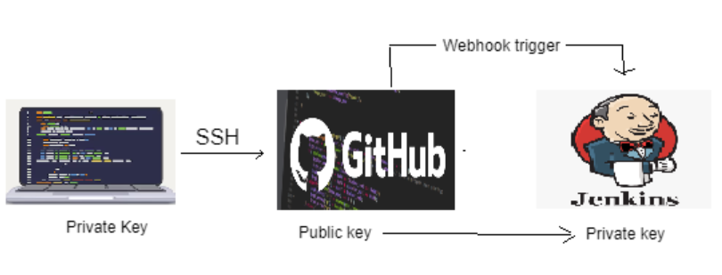
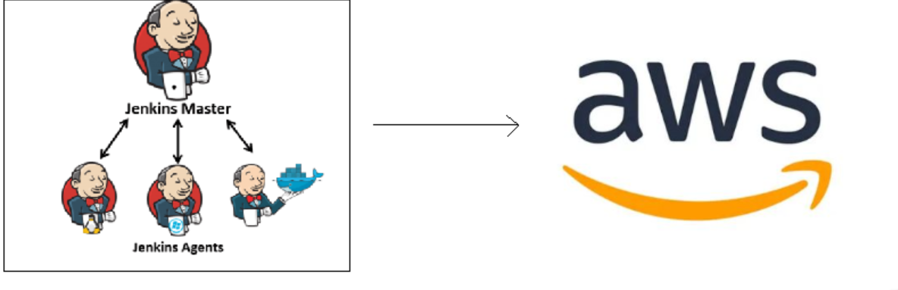

# Process of CICD/CDE

## Local Machine to Github
1. The Local machine with the code is pushed to git.
2. Local machine has the private key and github has the public, used to connect and push

## Github to Jenkins
1. Github has webhook - a listener that listens for all info pushed to git and auto triggers notifications
2. Github pushes what has been given to jenkins
   - Github has the public key whilst jenkins has the private key
   - connection is done through SSH

## Jenkins
### What is it?
- Open source 
- Automates build/test/development of software
- what is sent by Github, it will test and decide to accept and push or reject and send back
  - Master node: Branch where the main repo is stored in order to not break the pipeline if it doesnt work
  - Agent node: Isolated environment for the testing, used so if there is any problems it wont affect the whole code in the master node
1. Jenkins tests the code and if successful, will push to production (AWS, AZ)
2. If code has issues and fails, will send back to github

## Continuous Delivery 
- Process of delivering the code through automation but doesnt deploy the code, builds, tests and readies and gives back ready to manually deploy

## Continuos Deployment
- Full automation process like delivery except Jenkins deploys for you
### Why use which one?
Depends on your situation

## Diagram of CI 

